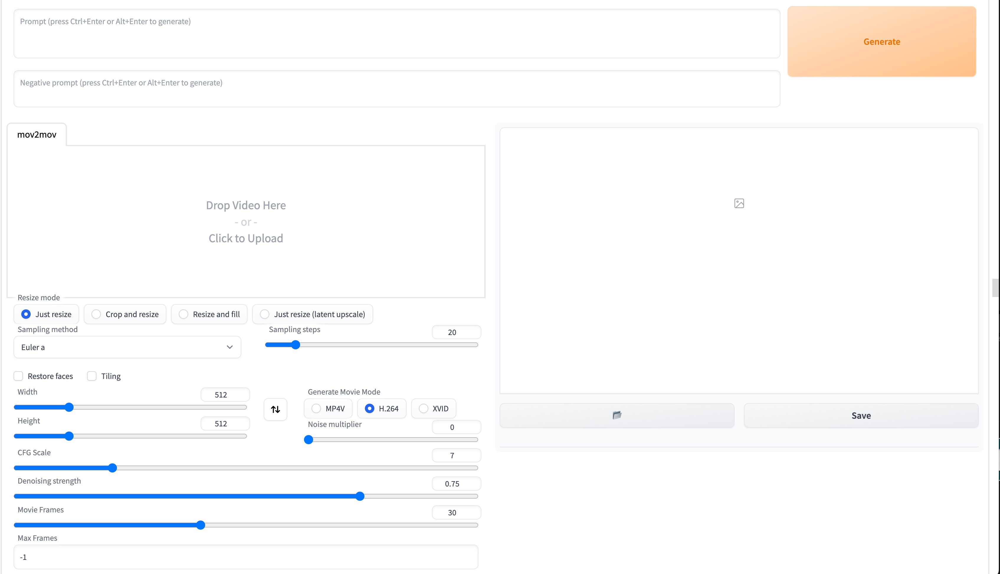

## Mov2mov

Mov2mov plugin for Automatic1111/stable-diffusion-webui.

Features:
- Direct frame-by-frame processing from video
- Packed into video after processing
- Pre- and post-processing of video for keying, compositing, etc.
  - Keying portraits
  - Compositing transparent backgrounds
  - Compose original backgrounds
  - Compose green screen
  - Compose backgrounds of specified images
  - Compose a specified video background
- Frame-by-frame processing of prompts and negative_prompt:
  - Start with *frame:prompt|| mark *start ||end
  - *1:1girl|||*100:2girl|| The first frame uses 1girl until frame 99, then frame 100 starts using 2girl until the end.
  - The same goes for negative_prompt.

## Installation method

1. Open the Extensions tab.
2. Click Install from URL
3. Type in the URL for extension's git repository 
4. Click Install
5. restart the WebUI

## Use of protocol

1. Please solve the licensing problem of video sources by yourself, any problems caused by using non-licensed videos for conversion, you should take full responsibility and all the consequences, not related to mov2mov!
2. Any video based on mov2mov posted to the video platform must clearly indicate the source of the video used for conversion in the introduction. For example, if you use a video posted by someone else and convert it through ai, you must give a clear link to the original video; if you use your own/your own video, you must also specify it in your profile.
3. infringement problems caused by the input source need to bear full responsibility and all the consequences. Note that many videos are explicitly stated not to be reproduced, copied!
4. Please strictly abide by the relevant national laws and regulations to ensure that the content is legal and compliant. Any legal responsibility caused by the use of this plug-in, you need to bear full responsibility and all the consequences, not on mov2mov!

## Attention

- The packaged video is in the directory `outputs/mov2mov-images/`.
- You may need to install opencv
- The ~~ directory must not have Chinese! ~~

~# FAQ

- ~~ Currently known to conflict with the `Additional Networks` extension

## Instructions
- Video tutorial:
  - https://www.bilibili.com/video/BV1Mo4y1a7DF
  - https://www.bilibili.com/video/BV1rY4y1C7Q5
- qq channel: https://pd.qq.com/s/akxpjjsgd
- discord: https://discord.gg/hUzF3kQKFW

## Thanks

- modnet-entry: https://github.com/RimoChan/modnet-entry
- MODNet: https://github.com/ZHKKKe/MODNet

## Feel good, buy the author a cup of coffee

Translated with www.DeepL.com/Translator (free version)
